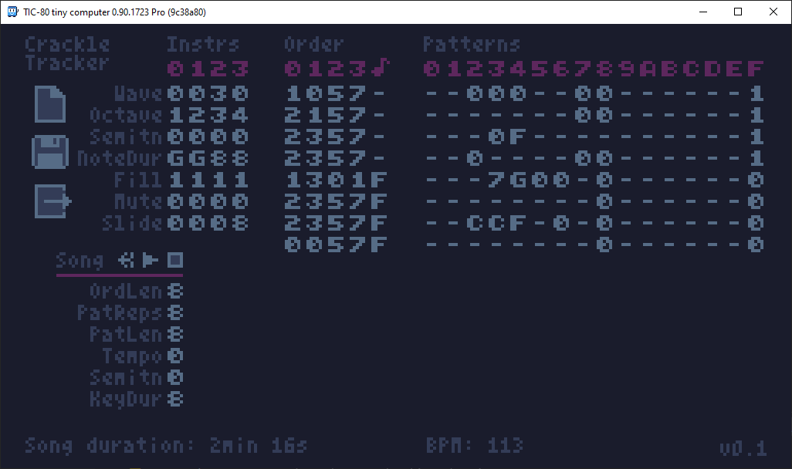

# Crackle Tracker

A TIC-80 tracker for tiny intros, targeting especially the 512b size
category.

Introduction
------------

The tracker supports 4 channels. Instrument settings are per channel.
The sound of each channel is controlled by the values in the "Instrs"
table.

Each channel has its order list which tells the general structure of the
song: which patterns appear in which order. Note that a pattern usually
is repeated several times before the order list advances.

The patterns are edited by semitone values, in base 36 (0-9A-Z). "-"
denotes no note.

Each note has a linearly decaying envelope (no attack, no sustain) and
this cannot be changed.

Importantly, the note duration of different channels do not have to be
the same, so the pattern row advances at different rates for each
channel, controlled by the NoteDur parameter. For example, even if all
channels are playing the exact same pattern, if one channel is playing
whole notes, one channel is playing half notes and one channel quarter
notes, the phrase loops when the channel that was playing whole notes
loops.

Nevertheless, the order list advances at the same time for all the
channels.

There is one extra channel, the "transpose channel". This channels
values are added to the pitch of all channels, to change the current
chord of the song. If your patterns only have notes from the power
chords (0, 7, C (12)...), you can use many different values here and
still the overall song stays in (some) key. If your patterns have notes
only from minor triads or major triads, at least values 0-5-7 (I-IV-V or
i-iv-v, respectively) stay in key. If you're fine with jazz, anything
works.

NOTE: "-" is actually 255, so the patterns the transpose channel is
playing should not contain "-"; use 0 instead.

The song data is kept in the persistent memory (pmem), so you can quit
and restart TIC-80 and the song should stay in memory.

Instrument settings
-------------------

- Wave: 0 = square, 1 = triangle, 2 = saw, 3 = noise. Triangle and saw
  have terrible high frequency whine, so most of the time, only square
  and noise are really useful.
- Octave: 12*octave is added to the note number.
- Semitn: Added to the note number.
- NoteDur: Controls how fast the pattern row advances or the duration of
  each pattern row. 1 = whole note, 2 = half note, 4 = quarter note, 8 =
  eight note, G (16) = sixteenth note
- Fill: Controls if following pattern(s) are played instead of repeating
  the same pattern every time. To be documented how it actually works...
- Mute: Temporarily mute channel.
- Slide: How quickly the pitch of the channel drops. 0 = no drop, 8 =
  typical for a kick.

Song settings
-------------

- Ordlen: Length of the order list.
- PatReps: How slowly the order list is advanced.
- PatLen: What is the length of each pattern, in rows.
- Tempo: Controls the tempo of the song. Actually, the envelope of each
  note it calculated with `%(16-tempo)`, so increasing the tempo also
  decreases the master volume.
- Key: Added to all note values of the song, controlling essentially
  the key of the song.
- ChdDur: How quickly the pattern rows of the chord channel advance.
- Scale: What scale to use. Most usefuls are: 0 = chromatic, 5 =
  pentatonic, and 7 = diatonic.
- Mode: What mode of the scale to use. In particular, when using the
  diatonic scale, 1 = ionian, 2 = dorian... etc.

Exporting
---------

Since TIC-80 has no way to access the file system, the only practical
way to export data from TIC-80 is by abusing the `trace` command. When
you click export, a fully functional TIC-80 LUA script that includes the
player and the song data is outputted to the console. You can then
copy-paste this to another file & start hand-optimizing unused player
features away.

The exported player stores the envelopes data array: d[0], d[-1], d[-2]
and d[-3] contain the envelopes of the channels 0-3, respectively, so
you can make your visuals flash to the music.

Saving & Loading
----------------

Saving works like exporting: when you save the song, the tracker prints
code to the console. When the code is ran, the song just saved is loaded
to the persistent memory. For example, if you copy-pasted the code to a
file called `saved-song.lua`, in order to load the song:

  1. `load saved-song.lua`
  2. `run`
  3. `load crackle-tracker.lua`
  4. `run`

The saving mechanism abuses `-- saveid:` script tag to make multiple
.lua files access the same persistent memory.

Prods using Crackle Tracker
---------------------------

[cracklebass](https://www.pouet.net/prod.php?which=90244) by brainlez
Coders! - Song included in the examples folder.

[Pulsating Magic Orb](https://www.pouet.net/prod.php?which=90937) by
brainlez Coders! - Song included in the examples folder.

[stroboscope](https://www.pouet.net/prod.php?which=92799) by brainlez
Coders! - Song included in the examples folder.

Credits
-------

[Veikko Sariola](https://github.com/vsariola) aka pestis/brainlez
Coders!

License: [MIT](LICENSE)

